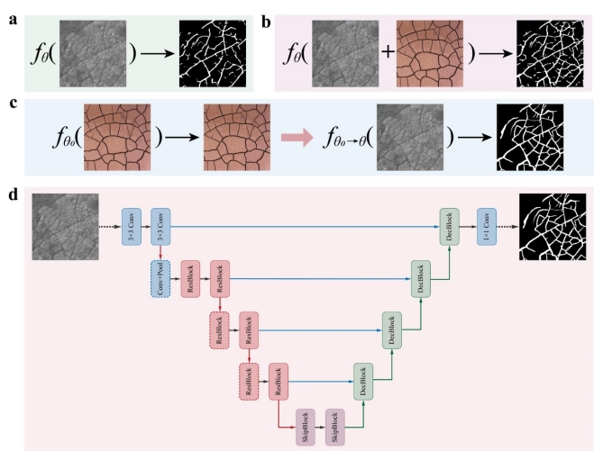

# Mars-CrackNet
code for paper "**Deciphering Mars Intermediate-Sized Cracks with Deep Learning**", which is submitted to *Journal of Geophysical Research - Planets*

Jin-Jian Xu, Hao Zhang, Chao-Sheng Tang*, Mohamed Ramy El-Maarry, Yao-Wen Yang*, Lin Li, Bin Shi

```
Jin-Jian Xu, Hao Zhang and Chao-Sheng Tang contributed equally to this work. *Corresponding authors: Chao-Sheng Tang and Yao-Wen Yang.
```

This study pioneers the application of deep learning principles in deciphering Mars intermediate-sized cracks(MICs).
A novel proposed deep learning-based framework (Mars-CrackNet) and a professional crack quantitative analysis
method is utilized to reveal the potential formation mechanism of MICs. Deep learning training results demonstrate
that the unlabeled Earth desiccation cracks (EDCs) images can be used to enhance the accuracy of recognizing MICs.
Quantitative analysis indicates that the probability density distributions of the crack intersection angle and crack
segmentation ratio of EDCs are remarkably similar to those of MICs. The integration of deep learning principles and
quantitative analysis provides a novel insight into the morphological similarities between EDCs and MICs, which
not only reveals the consistency in the formation mechanism for both natural phenomena, but also provides additional
evidence for the activity of liquid water and the arid climate environment in the early history of Mars. The findings
of this study provide a new perspective on the geological history of Mars, with potential implications for the search
for life.




**Figure 2**. An overview of how the Mars-CrackNet trains. **a**, process of conventional supervised learning. **b**,
process of joint training of MIC images and EDC images in a supervised learning manner. **c**, process of proposed
semi-supervised learning. **d**, structure of proposed Mars-CrackNet, which consists of several ResBlock, Skipblock,
and DecBlock in a U-Net structure.

##### Includes:
- train.py: main script to train Mars-CrackNet; 
- predict.py: main script to use Mars-CrackNet for recognizing ; 
- cfg.yml: dependencies

##### Requires:
- Python 3.7 
- PyTorch


```
+-- train.py: script to use train Mars-CrackNet
+-- predict.py: script to use test Mars-CrackNet
+-- cfg.yml: dependencies
+-- data: 
|   +-- mars.py: dataloader
|   +-- pre.py: script to use preprocess images
+-- models: folder where models are stored
|   +-- resunet.py: backbone of the proposed Mars-CrackNet
|   +-- unet.py: UNet
+-- utils: folder where tools are stored
|   +-- loss.py: loss functions
```